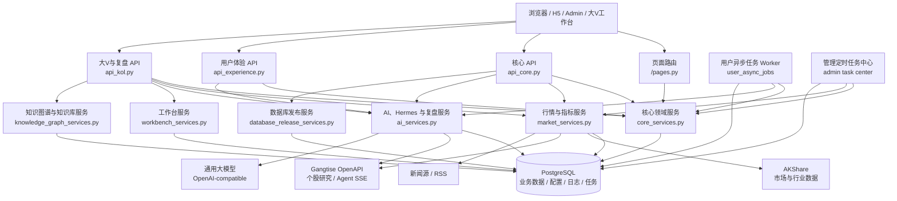
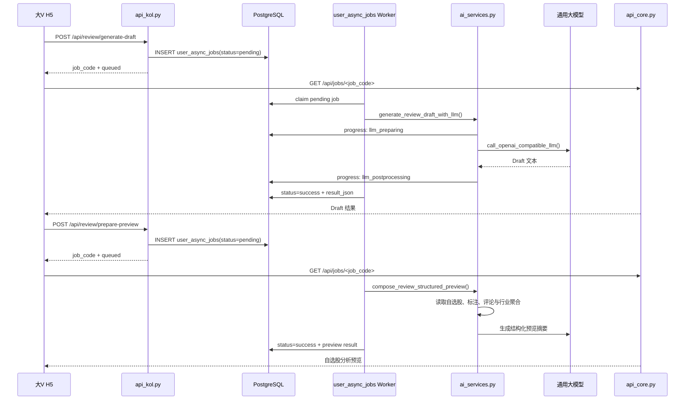
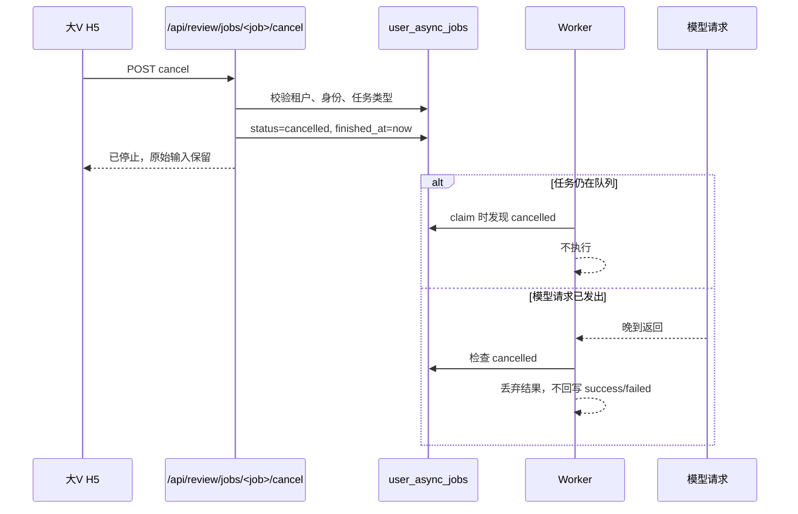
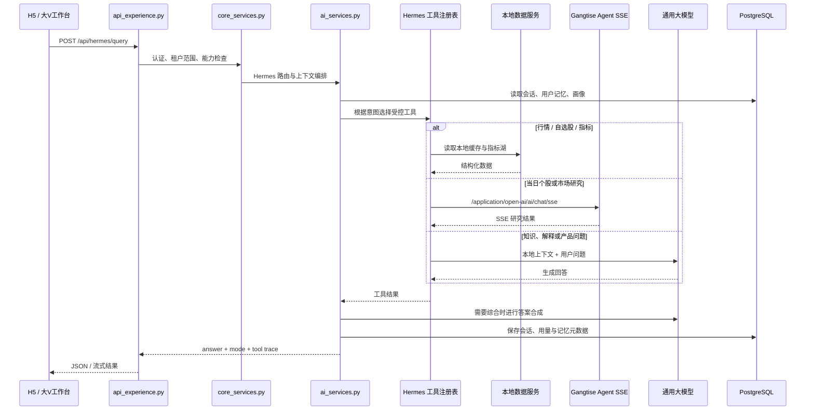
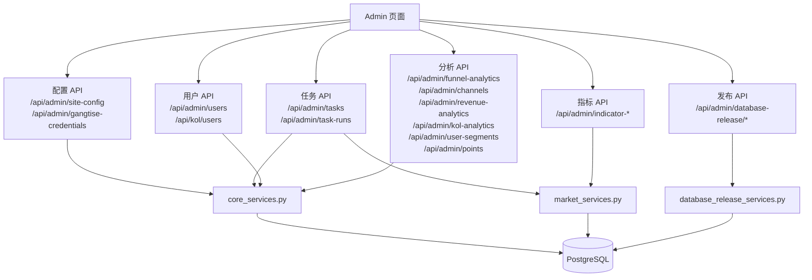

# API 调用关系图

本文描述当前程序的主要 API 调用关系。页面端通过 HTTP 调用 Flask API，API 层负责认证、租户隔离和参数校验，领域服务层负责业务编排，数据访问统一落到 PostgreSQL 或外部数据服务。

## 1. 系统总览



## 2. 页面到 API 分区

```mermaid
flowchart LR
    H5[H5 页面\n/h5] --> H5API[用户、行情、复盘、Hermes、私信 API]
    Admin[Admin 页面\n/admin] --> AdminAPI[分析、用户、任务、指标、配置、发布 API]
    KOL[大V工作台\n/kol-workbench] --> KOLAPI[工作台、知识、智能看板、粉丝管理 API]
    Login[登录页\n/login / login.html] --> AuthAPI[认证、注册、账号设置 API]

    H5API --> Core[/api/core\n行情 / 自选股 / 标注 / 评论]
    H5API --> Experience[/api/experience\nHermes / 社区 / 私信 / AI]
    H5API --> Review[/api/review\n复盘提交 / 查询 / 取消]
    AdminAPI --> Analytics[/api/admin/analytics\n漏斗 / 渠道 / 大V / 营收 / 分层 / 积分]
    AdminAPI --> Governance[/api/admin/governance\n任务 / 配置 / 指标 / 用户 / 发布]
    KOLAPI --> Workbench[/api/kol/workbench\n大V业务数据与能力增长]
    KOLAPI --> Knowledge[/api/kol/knowledge\n知识输入 / 查询 / 图谱]
    KOLAPI --> Smart[智能看板 / 指标定义 / 粉丝观察]
    AuthAPI --> Session[会话与权限]

    Core --> Analytics
    Experience --> Review
    Review --> Async[异步任务状态 API\n/api/jobs/<job_code>]
    Governance --> Async
```

## 3. API 路由清单与领域归属

```mermaid
flowchart TB
    subgraph Core[api_core.py]
        C1[市场与行情\n/api/market\n/api/market-overview\n/api/market-sectors\n/api/market-snapshot/refresh]
        C2[自选股\n/api/watchlist\n/api/watchlist/items\n/api/watchlist/search\n/api/watchlist/<stock_code>]
        C3[评论与标注\n/api/watchlist/<stock_code>/comments\n/api/watchlist/<stock_code>/annotations\n/api/tenant/<tenant>/watchlist-comment-analytics]
        C4[复盘与异步任务\n/api/review/voice-transcribe\n/api/review/prepare-preview\n/api/review/publish-embed\n/api/jobs/<job_code>]
        C5[Admin 数据与治理\n/api/admin/funnel-analytics\n/api/admin/channels\n/api/admin/revenue-analytics\n/api/admin/kol-analytics\n/api/admin/user-segments\n/api/admin/points]
        C6[Admin 任务与指标\n/api/admin/tasks\n/api/admin/task-runs\n/api/admin/indicator-*\n/api/admin/token-usage]
        C7[认证与账号\n/api/h5/auth-options\n/api/h5/login/password\n/api/h5/register/password\n/api/h5/account-settings]
        C8[用户管理与配置\n/api/admin/users\n/api/kol/users\n/api/admin/site-config\n/api/admin/simulation-data-policy]
    end

    subgraph Experience[api_experience.py]
        E1[Hermes\n/api/hermes/modes\n/api/hermes/query\n/api/hermes/sessions\n/api/hermes/usage/current]
        E2[社区与积分\n/api/community/*\n/api/user/profile\n/api/user/points-rules]
        E3[私信与 AI\n/api/dm/*\n/api/ai-analysis\n/api/ai/allocation\n/api/ai/forecast]
    end

    subgraph KOL[api_kol.py]
        K1[工作台与门户\n/api/kol/workbench\n/api/kol/portal-cms]
        K2[知识与图谱\n/api/kol/knowledge/*\n/api/admin/knowledge-*\n/api/evidence-chain/query]
        K3[复盘任务\n/api/review/jobs\n/api/review/generate-draft\n/api/review/compose-draft\n/api/review/jobs/<job>/cancel]
        K4[智能看板与粉丝观察\n/api/tenant/<tenant>/dashboard\n/api/tenant/<tenant>/smart-indicators\n/api/tenant/<tenant>/fan-stock-observation]
        K5[大V管理\n/api/kol/users\n/api/kol/business-analytics\n/api/kol/broadcast\n/api/kol/reply]
    end

    C1 --> Market[market_services.py]
    C2 --> Market
    C3 --> Market
    C4 --> ReviewSvc[ai_services.py + core_services.py]
    C5 --> CoreSvc[core_services.py]
    C6 --> CoreSvc
    C7 --> CoreSvc
    C8 --> CoreSvc
    E1 --> HermesSvc[ai_services.py]
    E2 --> CoreSvc
    E3 --> AISvc[ai_services.py]
    K1 --> WorkbenchSvc[workbench_services.py]
    K2 --> KnowledgeSvc[knowledge_graph_services.py + ai_services.py]
    K3 --> ReviewSvc
    K4 --> WorkbenchSvc
    K5 --> CoreSvc
```



## 4. 复盘两阶段调用链



## 5. 复盘任务取消链路



## 6. 行情、行业与指标数据链路

```mermaid
flowchart LR
    Scheduler[admin task center\nmarket_snapshot_sync\n每 5 分钟]
    Manual[Admin 手动执行\n/api/admin/tasks/<task>/run]
    MarketAPI[/api/market-overview\n/api/market-sectors]
    WatchAPI[/api/watchlist/<stock_code>]
    MarketSvc[market_services.py]
    Cache[(PostgreSQL\nmarket snapshots / indicator lake)]
    AK[AKShare]
    H5[H5 / Admin / 大V工作台]

    Scheduler --> MarketSvc
    Manual --> MarketSvc
    MarketSvc --> AK
    AK --> MarketSvc
    MarketSvc --> Cache
    H5 --> MarketAPI
    H5 --> WatchAPI
    MarketAPI --> MarketSvc
    WatchAPI --> MarketSvc
    MarketSvc --> Cache
```

## 7. Hermes 调用链



## 8. 管理后台治理链路



## 9. 关键设计约束

- 所有 API 先经过登录会话、角色能力和租户范围校验，再进入领域服务。
- `user_async_jobs` 是复盘、语音、知识等用户异步任务的统一状态源；页面通过 `/api/jobs/<job_code>` 查询进度。
- `is_simulated` 只用于本机模拟数据的生产可见性隔离，不应阻止用户异步任务被 worker 领取。
- 市场一览和行业板块数据统一由 `market_snapshot_sync` 写入 PostgreSQL，展示 API 只读取缓存，不应在页面请求中重复扣费拉取。
- Gangtise 仅用于明确声明的个股研究、Agent SSE 等能力；本地指标、行业和市场快照走本地数据服务。
- 发布、删除、取消类写操作必须使用 POST/DELETE，并在服务端再次校验租户、身份和目标对象，不能只依赖前端隐藏按钮。

